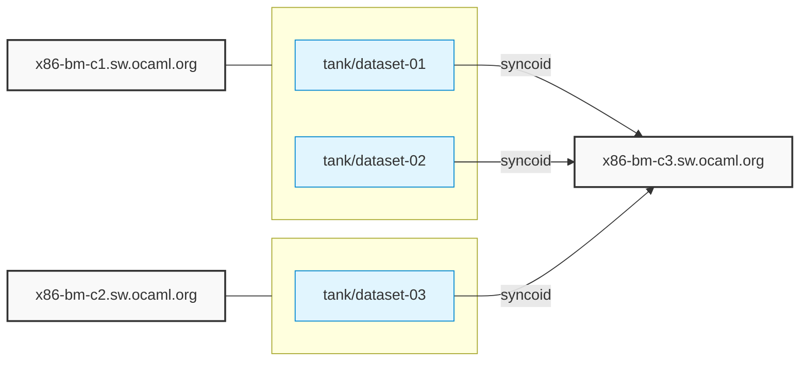

# ZFS Replication Topology

This document was automatically generated by the Ansible playbook on 2025-05-16 at 13:27:03.

## Replication Overview

This diagram shows the ZFS dataset replication relationships between hosts:

## Detailed Configuration

### Hosts and Datasets

#### x86-bm-c1.sw.ocaml.org

**Source Datasets:**
- `tank/dataset-01`
- `tank/dataset-02`

**Target Datasets:** None

#### x86-bm-c2.sw.ocaml.org

**Source Datasets:**
- `tank/dataset-03`

**Target Datasets:** None

#### x86-bm-c3.sw.ocaml.org

**Source Datasets:** None

**Target Datasets:**
- `tank/dataset-01`
- `tank/dataset-02`
- `tank/dataset-03`

### Dataset Details

#### tank/dataset-01

- **Source:** `x86-bm-c1.sw.ocaml.org`
- **Target:** `x86-bm-c3.sw.ocaml.org`
- **Snapshot Schedule:** `0 * * * *` (Runs at *:0)
- **Replication Schedule:** `30 */4 * * *` (Every 4 hours at 30 minutes past)
- **Syncoid Options:** `--no-sync-snap --compress=zstd --exclude=tank/backups/test`

**Retention Policy:**
- Frequently: 0
- Hourly: 12
- Daily: 60
- Monthly: 24
- Yearly: 5
- Auto-snapshot: yes
- Auto-prune: yes

#### tank/dataset-02

- **Source:** `x86-bm-c1.sw.ocaml.org`
- **Target:** `x86-bm-c3.sw.ocaml.org`
- **Snapshot Schedule:** `0 * * * *` (Runs at *:0)
- **Replication Schedule:** `15 */2 * * *` (Every */2 hours at 15 minutes past)
- **Syncoid Options:** `--no-sync-snap --compress=zstd`

**Retention Policy:**
- Frequently: 0
- Hourly: 36
- Daily: 30
- Monthly: 12
- Yearly: 2
- Auto-snapshot: yes
- Auto-prune: yes

#### tank/dataset-03

- **Source:** `x86-bm-c2.sw.ocaml.org`
- **Target:** `x86-bm-c3.sw.ocaml.org`
- **Snapshot Schedule:** `*/15 * * * *` (Runs at *:*/15)
- **Replication Schedule:** `0 */1 * * *` (Every */1 hours at 0 minutes past)
- **Syncoid Options:** `--no-sync-snap --compress=lz4 --no-privilege-elevation`

**Retention Policy:**
- Frequently: 4
- Hourly: 48
- Daily: 14
- Monthly: 3
- Yearly: 1
- Auto-snapshot: yes
- Auto-prune: yes

---

*This documentation is automatically generated and will be updated each time the Ansible playbook runs.*
